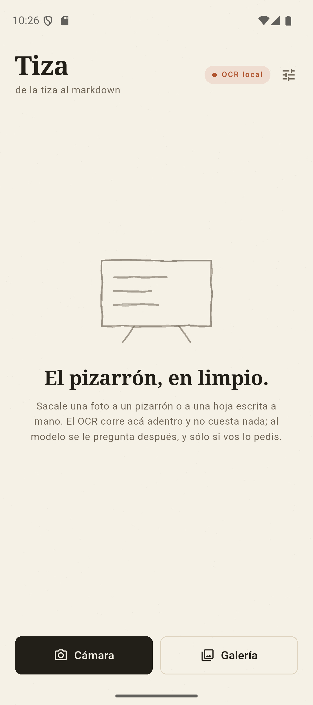
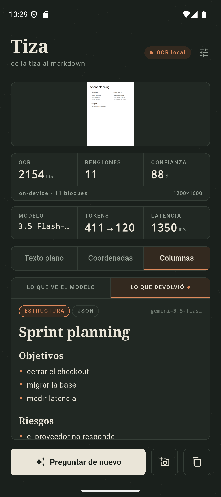
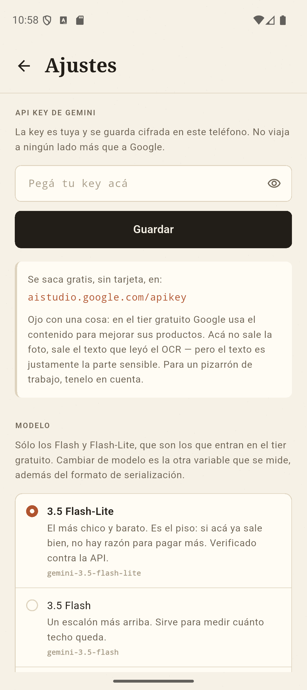
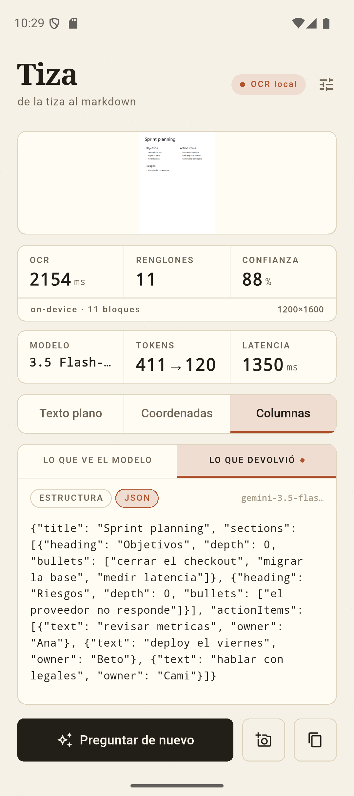
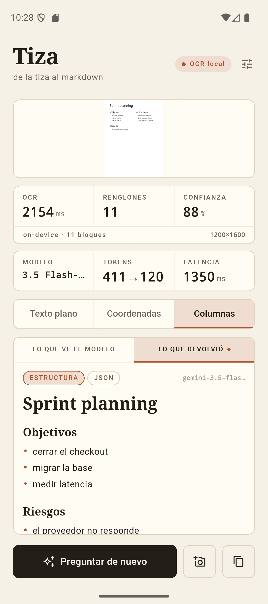
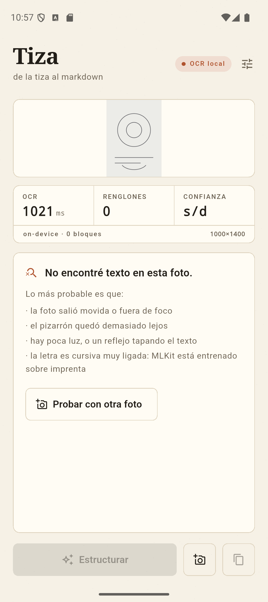
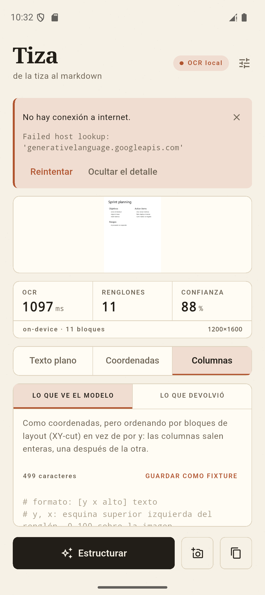

# Tiza

*From chalk to markdown.* Photo of a whiteboard or a handwritten page → structured
markdown, with the OCR running on the device and a single call to the model.

| paper | blackboard |
|---|---|
|  |  |

[Español](README.md) · **English**

> The app's UI is in Spanish, and so are the code comments and the program output quoted
> below. *Tiza* is Spanish for chalk.

## What this repo has to show

Not the app — the measurements, and above all **what they measured**.

I built three layout serialization formats, structured output against a schema, and a
column-detection algorithm. Then I built the eval, and it said this:

- **The cheapest configuration was also the best.** `plain` + free markdown scores 100%
  across the board, at 43% of the cost of the most expensive one that also gets it right.
- **The column algorithm has zero measurable gain.** It was the single largest piece of
  work — XY-cut, threshold, eight layout tests — and the model turned out to be indifferent
  to ordering once it has the coordinates: two serializations with radically different
  orders produce identical results, token for token.
- **Coordinates are not a quality improvement, they are the price of structured output.**
  Without them the schema invents action items; with free markdown they are not needed.

The numbers are below under *Results*, with **both** runs. The first one, on an easy case,
said the opposite. The reversal between them is the finding, so both stay.

The mistakes along the way are written down too: a model id copied from the documentation
without testing it, which returned 404; a metric of my own with a blind spot that I found
by reading the raw output rather than the table; and a threshold I deliberately did **not**
tune, because tuning it on five cases would have been overfitting.

The goal was to practise **the hybrid pattern**: do the cheap work on the device and spend
tokens only where the model adds value. Everything else — accounts, history, backend,
multi-language — was explicitly out of scope.

## Status

Phase 1, steps 1 to 6 closed. Step 7 has the harness built and is missing the golden set.

| Step | Status |
|---|---|
| 1. Skeleton: one screen, camera/gallery, preview | done |
| 2. Raw OCR with MLKit + latency and confidence on screen | done |
| 3. Layout serialization, interchangeable formats | done |
| 4. First LLM call (Gemini Flash), no schema | done |
| 5. Structured output with a schema, strict parsing and rendering | done |
| 6. The error states, each with its own recovery | done |
| 7. Eval runner, metrics and fixture export | done |
| 7b. Five synthetic layout cases, with MLKit's real boxes | done |
| 7c. The golden set: 15-20 real photos with their markdown | **pending** |

## Architecture

```
Photo (image_picker)
 └─> MlkitOcrService              [on-device, free]
      └─> OcrResult               (pure Dart: blocks → lines + boundingBox + confidence)
           └─> LayoutSerializer   (interchangeable)
                └─> LlmClient     (interchangeable)  [expensive, and only on request]
                     └─> StructuredNote  (validated against the schema)
                          └─> renderNoteMarkdown()   → markdown
                          └─> StructuredNoteView     → widgets
```

Calling the model is an explicit user action, not an automatic step in the pipeline. Until
"Estructurar" is tapped, nothing has left the phone.

Two decisions that matter more than they look:

**`OcrResult` carries no native types.** [`lib/ocr/mlkit_ocr_service.dart`](lib/ocr/mlkit_ocr_service.dart)
is the only file that knows about MLKit; from there on everything is pure Dart. That is why
the serialization tests run with `flutter test` on the machine, with no emulator, and why
`OcrResult.toJson()` is enough to freeze a photo's OCR as a fixture. The eval runner reads
those fixtures instead of re-running MLKit, which is why the evals take milliseconds, need
no device, and give identical results across runs.

**`LayoutSerializer` is an interface, not a function.** The serialization format is *the*
variable the evals move. Comparing two formats has to be a change of value, not a change of
code.

## The three serializers

`plain` — the blocks in MLKit's own reading order, without positions. The baseline.

`coords` — one line per text line, with `[y x height]` normalized to 0–100:

```
# formato: [y x alto] texto
[  5   8 100] Sprint planning
[ 15  54  52] Action items
[ 15   9  62] Objetivos
```

The height is **relative to the largest text in the photo**, not to the image height.
Normalized against the image, a title and a bullet land on 4 and 2, two indistinguishable
values; relative to the maximum they land on 100 and 42.

`columns` — the same format, but ordering by layout blocks with **XY-cut** instead of by
`y`. It exists to fix the finding from step 3, and the measurement of whether it does is
below.

XY-cut is the classic page segmentation algorithm: find the widest whitespace gap, cut
there, repeat on each half. Two things are specific here:

**The cut axis is not fixed in advance**: at each level the largest gap wins, measured in
proportion to the image. In the test photo the gap between columns (15% of the width) beats
the gap below the title (5.6% of the height), so it cuts into columns first and each one
comes out whole. Always cutting horizontally first also leaves the blocks contiguous, but it
puts "Riesgos" after the right-hand column — a different sequence from the one a person
would read — and **the ordering metric does not penalize that**, because it counts
contiguity, not sequence. That is a limit of the metric, not a virtue of the adaptive axis:
the reason to pick it is that it generalizes better, not that this case proves it.

**A gutter has to measure at least 4 text heights**, on top of 4% of the width. This
condition came out of a concrete bug and is covered by a test: a short heading with its
bullets indented to the right leaves a gap wider than 4%, and the algorithm cut it as if
they were two columns. With a single section the order came out right by accident — the
heading sits to the left of its bullets — but with two sections all the headings went to
the front:

```
Objetivos, Riesgos, primero, segundo, tercero   ← what came out
Objetivos, primero, segundo, Riesgos, tercero   ← what was correct
```

Absolute distance does not tell an indent from a gutter; distance measured in text heights
does. An indent is two or three, a gutter is several more.

## Calling the model

**The user supplies the API key** (BYOK), stored with `flutter_secure_storage` — Android
Keystore, RSA OAEP + AES-GCM. It is not a shortcut: a key compiled into the APK can be
extracted from the binary, so embedding it would protect nothing, and this way each user
spends their own free tier. A nice practical consequence: the project builds and can be
walked end to end without any key at all.



The screen says where to get the key and **also the fine print**: on the free tier Google
uses the content to improve its products. The photo does not leave the device, the OCR text
does — and the text is precisely the sensitive part. Hiding that would have been easier.

**`LlmClient` is an interface**, with [`GeminiClient`](lib/llm/gemini_client.dart) going out
to the network and [`FakeLlmClient`](lib/llm/fake_llm_client.dart) returning a fixed reply.
The fake is not test decoration: it lets you walk the whole app without a key, and it shows
up labelled as simulated in the model panel — presenting an invented result without saying
so would be exactly the problem this project tries to measure.

**The model is chosen in settings**, among the Flash and Flash-Lite models that fall inside
the free tier. `ModelOption` separates the stable `id` — the one that goes into the results
table — from the `apiId` Google expects, so if Google renames a model, both the user's
preference and the eval history survive.

That leaves **three axes** for step 7 — three serialization formats, three models and two
output modes (schema or free markdown) — and the results table goes from a column to a
matrix of 18 combinations. All three are switched from inside the app, without touching
code.

Four debatable decisions, which is why they are annotated in the code:

- **The key goes in the `x-goog-api-key` header, not in `?key=`.** The official docs show
  the query parameter, but there the key ends up in access logs, shell history and any proxy
  along the way.
- **The rules go in `systemInstruction`, separate from the OCR text.** If they travelled in
  the same block, a line from the whiteboard that reads like an instruction could compete
  with them. The note is data, not an order. There is a test that verifies the separation.
- **`temperature: 0`.** Without it, running the golden set twice gives different results and
  the evals compare nothing.
- **Replies are cached per (serializer, model).** The app exists to compare formats, so going
  back and forth between them is the most frequent gesture there is; without a cache every
  round trip pays tokens again for an identical input.

On the free-markdown path the reply is shown **unrendered**, on purpose. Step 4 exists to see
what the model returns before constraining it, and rendering hides exactly what you are
looking at: a heading at the wrong level, a stray bullet, a code fence nobody asked for. The
only thing done to it is marking the syntax in terracotta.

## The schema and strict validation

The central change in step 5 is this: **the model stops writing the markdown**. The API
returns data against a [`responseSchema`](lib/llm/note_schema.dart), it gets validated, and
the markdown is produced by `renderNoteMarkdown`, a pure function. The format stops depending
on the model obeying and becomes deterministic.

That had a side effect I did not expect: **the prompt got shorter**. With the schema in
place, every formatting instruction — "reply with markdown only", "do not wrap it in a code
fence" — becomes unnecessary, because the API enforces it. What remains are content rules,
which no schema can enforce: do not invent, do not fix the OCR, do not put the same line in
two places. There is a test that verifies the schema prompt no longer mentions formatting.

The schema is **deliberately flat**: two levels and no more. The spec asks for it in those
words, and `depth` is the concession — it expresses hierarchy without nesting the structure,
so the possible error is a badly chosen number rather than a badly built tree. There is a
test that fails if the nesting grows.

Two API details that cost a 400 if ignored, both covered by tests:

- Types go in **uppercase** (`STRING`, `OBJECT`, `ARRAY`, `INTEGER`). It is a proto enum, not
  standard JSON Schema. A test walks the whole schema and fails if a lowercase one shows up.
- `propertyOrdering` is a Google extension and it is not cosmetic: the model generates in
  that order. In `actionItems`, `text` comes before `owner`, because deciding the assignee
  before having written the task pushes it to invent owners.

### The decision that matters: discard and count

Faced with an invalid entry, [`parseStructuredNote`](lib/llm/structured_note.dart) **discards
that entry and carries on**, recording what it discarded. The three alternatives were worse:

- Throwing away the whole reply over one empty bullet wastes a call that was 95% correct.
- Accepting it silently makes the evals measure too much.
- Retrying automatically fixes the screen and **hides the failure rate**, which is precisely
  the number this project wants to measure. The user has a button to ask again.

One case is worth calling out: a section that arrives without a heading but with bullets is
not discarded, it is kept untitled. Throwing it away would lose text the OCR did read
correctly.

Malformed JSON is fatal — there is nothing to recover there.

The discard count appears in the model panel and the detail above the note, because a model
that gets the content right but returns three invalid entries per photo is not equivalent to
one that returns zero. That count is a column in the results table.



The JSON view next to the structure answers a different question: if the note came out wrong,
did the model get it wrong or did it misunderstand the schema? This screenshot is of a real
reply, and it has no discards — the model complied with the schema. The validation panel
appears when it does not, and the simulated case carries invalid entries on purpose so that
state can be seen.

### Rendering

The note is drawn with native widgets, without any markdown package. It is not just that
`flutter_markdown` is discontinued: **it would not be needed even if it existed**, because
after the schema what arrives is typed data rather than text to interpret. That is the
concrete benefit of imposing the structure, beyond output quality.

The reply viewer has two views, ESTRUCTURA and JSON, because they answer different questions:
the first says whether the note came out right, the second whether the model understood the
schema. With only the first, a field error looks like a content error.

### What is verified and what is not

Response parsing and error mapping have tests with sample JSON: tokens, `finishReason`,
content-filter blocking, a 200 with zero text because of the token limit, a body that is not
JSON, and the 400/401/403/429/5xx codes. Step 5 adds the schema (uppercase types, consistent
`required`, bounded nesting), every branch of the strict parser, and the rendered markdown
character by character.

The shape of the request is verified against the **real API**, with a deliberately invalid
key:

```
HTTP 400 · API_KEY_INVALID · "API key not valid. Please pass a valid API key."
```

That confirms three things a mocked test cannot: that the URL and the model id are right (a
malformed path would give a 404), that Google **reads** the header — it evaluated the key and
rejected it, rather than saying it was missing — and that this 400 lands in the `invalidKey`
branch of the mapping.

The success path is verified too, with a real key:



The two separate panels are deliberate: on top what came out free on the phone, below what
cost tokens. The whole thesis of the project on one screen.

| | |
|---|---|
| model | `gemini-3.5-flash-lite` |
| serializer | `columns` |
| tokens | 411 → 120 |
| latency | 1350 ms |
| discarded entries | 0 |

### The model id that was wrong, and why

The first real call did not return 200 but **404**:

```
This model models/gemini-2.5-flash is no longer available to new users.
```

The 2.5 family — the one the project spec suggested — is retired for new keys. Same with
`gemini-2.5-flash-lite`, tested separately. Both left the picker: an option that always fails
is not an option.

Where the error came from matters more than the error itself: I took the ids from a summary
of the documentation, without testing them. That same summary had already given me the wrong
request shape, so the signal was there. **A model id is not verified by reading docs, it is
verified by making the call.**

And the 404 only became readable thanks to the "ver el detalle" affordance from step 6:
without it, it was a mute `404`.

## Evals

The harness is built and verified; what is missing are the photos.

**Fixtures store the OCR, not the image.** This is the decision that holds everything else
up: the evals run on the machine in milliseconds, without an emulator and without MLKit, and
two runs of the same configuration give exactly the same thing. It is also the reason
`OcrResult` carries no native types since step 1 — this was the plan from there. The image is
stored alongside only so it can be looked at when a number does not add up.

```
fixtures/<case>/
  ocr.json          OcrResult.toJson(), frozen
  expected.md       the markdown that should come out, written by hand
  foto.png          to look at when something does not add up
  serializado.txt   what the model saw, readable without running anything
```

**The runner is a script, not a test.** It spends tokens against a real API, and something
that costs money must not be triggerable by running `flutter test`. What can actually have
bugs — the metrics and the two parsers — is under test.

```bash
dart run tool/evals.dart --dry-run
```

```bash
dart run tool/evals.dart --serializers plain,coords --models flash-lite-3.5,flash-3.5 --modes schema,freeMarkdown
```

All three axes move by flag and the script prints how many calls it is going to make before
starting. `--fake` runs the whole pipeline with the simulated reply: zero tokens, no key, and
it is what verifies the plumbing is connected without measuring anything about the model.

### The metric that costs nothing

Before the table that spends tokens, the runner prints another one that **does not call the
model**. Over the five layout cases in `fixtures/`:

```
| serializador | casos | saltos | ideal | de más | inversiones | perfectos |
|---|---|---|---|---|---|---|
| plain        | 5     | 16     | 12    | 4      | 2           | 3/5       |
| coords       | 5     | 26     | 12    | 14     | 26          | 1/5       |
| columns      | 5     | 14     | 12    | 2      | 2           | 3/5       |
```

A serializer that walks each block end to end before moving to the next makes exactly
`blocks - 1` **switches**. Every extra switch is one time it interleaved content from two
different blocks. **Inversions** count separately the blocks that arrived whole but out of
place.

That second column was added because the first had a real blind spot: `columns` scored zero
extra switches on the two-column case and still delivered the right-hand column before the
lower block of the left-hand one. Contiguity is not sequence, and the metric was calling it
perfect. I found it by reading the output of `--show`, not the table — which is why that flag
exists.

What the numbers say:

- **`coords` is decisively the worst**: 14 extra switches and 26 inversions, failing 4 of 5.
  Ordering by `y` is what the spec proposed, and the measurement rules it out.
- **`columns` and `plain` tie on perfect cases but fail on different, complementary ones**,
  and `columns` makes half the extra switches.
- And a fact about MLKit: **its own block order also splits indented sections**. On case
  `001` it returns `Notas, Objetivos, Riesgos, cerrar…` — the two headings together and then
  all the bullets. That is exactly the bug my XY-cut had before the text-height condition.

This is the best part of the harness: iterating on the layout is free and deterministic. That
is why `LayoutSerializer` exposes `order()` separately from `serialize()`, and why the runner
lists **which case** fails per serializer — two extra switches can be a known limit or a new
bug, and without the breakdown you cannot tell them apart.

### The threshold that cannot be tuned yet

The "gutter ≥ 4 text heights" condition has a value that is **not tuned, and cannot be tuned
with the data available**. Measured:

| multiplier | indented sections | two columns |
|---|---|---|
| 4 or 3 | fine | 1 inversion |
| 2 | **breaks** | fine |

The two cases contradict each other because the indent gap depends on the length of the
heading — which is content, not layout. I tried two alternative signals to break the tie:
requiring both sides to have more than one line, and requiring their `y` ranges to overlap.
Neither separates the cases.

It stayed at 4, the value that comes from reasoning rather than from fitting against five
images. Lowering it to 2 would give 4/5 instead of 3/5 in this table, and it would be
**overfitting on five synthetic cases**: the table improves and there is no reason to believe
the algorithm did. That gets decided with real photos.

And because a number that improves without being able to look at what changed is a number you
cannot trust, `--show` prints the raw serialization of each case.

### The metric decisions

The spec is explicit that **character-by-character accuracy is not the goal**. What is
measured is whether the content ended up in the right place, and that forces four decisions:

- **The comparison strips accents.** The OCR loses them — on the test photo it returned
  "metricas" — and the prompt forbids the model from correcting what the OCR read. If the
  comparison were accent-sensitive, it would flag a structuring failure where there was an
  OCR one. They are different things and are measured separately: OCR quality is already
  measured by MLKit's confidence.
- **Bullets are compared flattened**, without requiring them to land in the same section.
  Penalizing the same error twice — once for the bullet and once for the section — would make
  the numbers unreadable.
- **The assignee is counted separately.** An action item correctly detected with the wrong
  owner is a different, and less serious, error than not detecting it.
- **The schema-less mode is read with the same parser as the golden set.** A more permissive
  one for the reply than for the expectation would give free markdown an artificial
  advantage.

Also: incomplete cases are skipped **and reported**. A golden set that claims 20 cases and
silently runs 14 produces numbers that mean nothing.

### How to build the golden set

The "lo que ve el modelo" tab has a **GUARDAR COMO FIXTURE** action. It saves that photo's
OCR into the app's external storage, with a blank `expected.md`.

```bash
adb pull /sdcard/Android/data/com.agustin.tiza/files/fixtures ./fixtures
```

Then each `expected.md` is filled in **looking at the photo, not at the model's reply**:
copying the model's reply measures the model against itself. While the file is left
unfilled, the runner skips the case and says so.

A bug that came out of doing this flow for real: the export used `File.copy` for the photo,
which **inherits the permissions** of the picker's cache file (`-rw-------`). The file showed
up in the folder but `adb pull` failed with "Permission denied" without giving any hint. It
now writes the bytes instead.

### Results · first run, 1 case

With `gemini-3.5-flash-lite`, on **one** case: the synthetic image from step 3. The three
serializers × the two output modes:

| serializer | mode | title | bullets P/R | actions P/R | owners | discards | tokens | latency |
|---|---|---|---|---|---|---|---|---|
| plain | schema | 1/1 | 100% / 100% | 100% / 100% | 100% | 0 | 245→205 | 2148 ms |
| plain | free markdown | 1/1 | 100% / 100% | 100% / 100% | 100% | 0 | 277→60 | 651 ms |
| coords | schema | 1/1 | 100% / 100% | 100% / 100% | 100% | 0 | 411→205 | 1196 ms |
| coords | free markdown | 1/1 | 100% / 100% | 100% / 100% | 100% | 0 | 443→60 | 671 ms |
| columns | schema | 1/1 | 100% / 100% | 100% / 100% | 100% | 0 | 411→205 | 1242 ms |
| columns | free markdown | 1/1 | 100% / 100% | 100% / 100% | 100% | 0 | 443→60 | 727 ms |

**All six configurations tie at 100%.** That does not say they are equivalent: it says **this
case does not discriminate**. Printed text, OCR without a single error, two columns and seven
lines — any of the paths solves it. It is a ceiling effect, and a saturated eval measures
nothing.

Reading it that way matters: the honest conclusion from this table is **not** "coordinates
work", it is "on this case coordinates buy nothing, and they cost". The second run below,
with hard cases, reverses that reading — which is why both stay in this README instead of
only the last one.

#### What can be concluded

All the difference is in the cost, and those numbers are real:

- **Coordinates cost 166 input tokens per photo** (245 → 411, 68% more) for an identical
  result. `columns` costs exactly the same as `coords`: it changes the order, not the volume.
- **The schema costs 3.4× the output tokens** of free markdown (205 → 60), because JSON is
  more verbose than markdown. And output is the expensive side: Gemini's price list for Flash
  charges output at 5× input.
- Weighting output 5×, the cheapest configuration (`plain` + free markdown) comes to ~577
  units and the most expensive (`columns` + schema) to ~1436: **2.5× difference for the same
  note.**
- **Latency follows**: the schema roughly doubles the time, consistent with the output tokens.
  The 2148 ms in the first row is cold start, not a real difference between configurations.
- **Zero validation discards** across all six. The 2 that show up with `--fake` are the
  invalid entries the simulated reply carries on purpose; the real model complied.

And a confirmation of something claimed in step 5: **the schema prompt is shorter**. 245
against 277 input tokens over the same serialization — the formatting instructions that were
deleted weigh 32 tokens per call, and the `responseSchema` does not offset them.

I say nothing about the absolute price per photo: I did not verify the Flash-Lite rate, only
the Flash one. The ratios above do not depend on it.

### Results · second run, 5 cases

With the five layout cases. The first pass lost 12 of 30 calls to free-tier 429s; after
adding throttling to the runner, five of the six configurations completed. Cost weights
output 5×, the ratio Gemini publishes for Flash:

| serializer | mode | n | title | bullets P/R | actions P/R | tokens | rel. cost |
|---|---|---|---|---|---|---|---|
| plain | free markdown | 5/5 | 5/5 | 100% / 100% | 100% / 100% | 262→46 | **492** |
| plain | schema | 5/5 | **4/5** | 100% / **88%** | **50%** / 100% | 230→136 | 910 |
| coords | free markdown | 5/5 | 5/5 | 100% / 100% | 100% / 100% | 409→44 | 629 |
| columns | free markdown | 5/5 | 5/5 | 100% / 100% | 100% / 100% | 409→44 | 629 |
| coords | schema | 5/5 | 5/5 | 100% / 100% | 100% / 100% | 377→154 | 1147 |
| columns | schema | 5/5 | 5/5 | 100% / 100% | 100% / 100% | 377→154 | 1147 |

**I predicted all six would give 100% and I was wrong.** Five of six do; the one that fails is
not the one I expected, and the cheapest is among the ones that get it right.

#### The first sign that coordinates help

`plain` + schema is the only one that degrades: it loses a title, 12% of the bullets, and —
most interestingly — **invents action items**. Precision of 50% with recall of 100% means it
returned six where three were expected: on cases that have none, it made them up.

The mechanism is plausible: the schema demands deciding whether each line is a bullet or an
action item, and without positional information the model has nothing to tell them apart, so
it guesses. With free markdown it does not feel obliged to fill the field. And with
coordinates the problem disappears.

It is exactly the opposite of what the one-case run said, and that was to be expected: there
was nothing there to tell apart.

#### The model does not care about order, which leaves XY-cut without a job

`coords` and `columns` produced **exactly the same numbers in both modes**: 377→154 with the
schema and 409→44 with free markdown, 100% across the board. Identical, twice. And they are
not similar serializations: they carry the same information in a very different order —
`coords` accumulates 14 extra switches and 26 inversions, `columns` 2 and 2.

It is the cleanest possible confirmation that **the model is indifferent to order once it has
the coordinates**: it reads them and reorders on its own. What `plain` lacks is not order, it
is positional information, and that is why it is the only one that breaks.

Two consequences follow that do not favour me, and are written down anyway:

- **XY-cut solves a problem the model did not have.** It is the piece of the project that took
  the most work — the algorithm, the threshold, eight layout tests — and its measurable gain
  over `coords` is zero.
- **The ordering metric does not predict quality**, which was the only thing that would make
  it useful as a cheap replacement for the token-spending eval. It is good for debugging a
  serialization, not for deciding which one to use.

And the cost conclusion is more uncomfortable still: **the cheapest configuration is also
perfect**. `plain` + free markdown scores 100% at 492 cost units; the most expensive one that
also scores 100% costs 2.3× that.

With the full matrix, the useful reading is this: **coordinates are not a quality improvement,
they are the price of structured output.**

| what you want | what you need | cost |
|---|---|---|
| markdown and nothing else | `plain` + free markdown | 492 |
| typed data | coordinates + schema, mandatory | 1147 |

Without positions the schema invents action items, so if you want typed data you pay for the
coordinates. If markdown is enough, you do not need them. That is a product decision with a
measured price, which is what the table had to give and did not when everything tied at 100%.

Two caveats so this is not over-read:

- These are five cases of **printed text** where the OCR barely fails. The premise behind the
  coordinates is that on a real whiteboard MLKit's reading order is garbage and positions are
  the only thing that saves the structure. That remains unproven.
- The schema does not compete on cost alone: it returns **typed data**, which is what enables
  the native rendering and anything built on top of it later. Costing more does not make it
  wrong, it makes it a decision with a known price — which is exactly what the table had to
  give.

#### What was fixed in the runner

Two defects that came out of this run:

- **There was no throttling or retrying.** 30 calls back to back exceed the free tier's
  per-minute limit. There is now a 4.5 s default pause (`--delay`) and retries with growing
  backoff on 429 and 5xx. An exhausted quota is not a model failure, and counting it as one
  mixed infrastructure with quality.
- **The table invited comparing incomparable rows.** `n` now prints as a fraction, incomplete
  rows are marked with ⚠, and there is an explicit warning that they do not compare.

#### What is left unmeasured

The **layout** axis is closed as far as it can be synthesized. The five cases — generated by
[`scripts/generar_casos_layout.ps1`](scripts/generar_casos_layout.ps1) and run through the app
so they carry MLKit's real boxes — do discriminate, and the answer they gave was that the
model does not care about order.

The other two axes still hit a ceiling. These cases are **printed text**: the OCR barely fails
and the models do not differ from each other. Moving them needs real handwriting, with glare,
uneven focus and crooked lines.

The distinction matters because it decides what can be measured without leaving the machine:

| axis | what it needs | status |
|---|---|---|
| serializer (layout) | hard geometry, which can be synthesized | measured |
| OCR (reading quality) | real handwriting photos | pending |
| model and output mode | content that is ambiguous to structure | pending |

The real golden set is 15-20 real photos, and code cannot do that part.

## The error states

The spec asks for three visible ones. Seven came out, because the model path has more ways to
fail than the three obvious ones, and each needs a different action.

**The rule is that no failure is a dead end.** [`recoveriesFor`](lib/ui/screen_error.dart) is
a pure function mapping each failure type to the user's ways out, and there is a test that
walks the whole enum and fails if any of them is left without one — including failures added
after today. That is the easiest mistake to make here.

The recoveries are not interchangeable, and that is where the criterion lives:

| Failure | Recoveries | Why those |
|---|---|---|
| Missing key | configure it · see a simulated reply | Retrying without a key fails identically: offering it would be lying about what will happen |
| Rejected key | configure it | Same |
| Quota exhausted | retry · pick another model | Free-tier limits are **per model**, so dropping to a smaller one is a real way out |
| No network | retry | |
| Server down | retry | |
| Blocked content | another photo | Filters are deterministic on the same content: retrying gives the same block |
| Malformed reply | retry | Usually a stumble by the model, not something deterministic |

**The provider's detail is not thrown away.** It starts collapsed behind a "ver el detalle",
because the friendly message is enough for almost everything, but when it is not, it is the
only thing that explains what happened. Discarding it to keep the screen clean is the most
common mistake in error states. In the case of JSON that does not validate, the detail is
**the text the model returned** — trimmed to 300 characters — which used to be lost in the
`catch`.

**OCR with no text is not an error note, it is a state.** It is a legitimate outcome of the
free path, and the metrics panel proves it by showing 0 lines and how long it took. What the
user needs there is not an apology but a reason it might have happened, so
[`NoTextState`](lib/ui/widgets/no_text_state.dart) lists the four causes from most to least
frequent. The last one — "the handwriting is heavily joined cursive: MLKit is trained on
print" — is a real limitation worth stating instead of hiding.



The panel above it is the proof that the free path ran: 1021 ms, 0 lines, confidence `s/d`.
Without those numbers, "I found no text" and "something broke" look the same.

### How each one was verified

| State | How |
|---|---|
| OCR with no text | An image without text pushed to the emulator. 699 ms, 0 lines, confidence `s/d` |
| No network | `adb shell svc wifi disable` + `svc data disable`, with a saved key so it passes the pre-check |
| Rejected key | A real API call with an invalid key (see above) |
| JSON that does not validate | Tests only: forcing it from the UI would need a valid key and a model that derails on demand |

The no-network one produced the most useful screenshot in the project:



The error says `Failed host lookup: 'generativelanguage.googleapis.com'` and, above it, **the
OCR panel reads 1097 ms and 11 lines**. The photo was picked and recognized with the network
already off: the cheap path worked offline end to end, and the only thing that failed was the
piece that needed the internet.

## Design

Two opposite surfaces: **paper** in light mode, **blackboard** in dark. What you photograph is
a whiteboard and what you get is a sheet of paper, so dark mode is the only place that can be
said without writing it down. The tokens live in a `ThemeExtension`
([`lib/theme/tiza_theme.dart`](lib/theme/tiza_theme.dart)) with semantic names — `ink`,
`paper`, `rule`, `accent` — so no widget knows which material it is drawing on.

The typefaces are the platform generics, `serif` and `monospace`, which Android resolves to
Noto Serif and Roboto Mono: real typographic contrast without downloading a font or adding a
dependency.

Two elements do work beyond decoration:

- **The metrics panel** is at the top, not at the bottom. The thesis of the project is that
  expensive work is avoided by measuring, and latency, line count and confidence are the
  evidence.
- **The character counter** above the serialization is the most direct proxy for token cost.
  Having it in view while comparing formats prevents picking the richest one without looking
  at the price: on the same photo `plain` gives 191 characters and `coords` 499, about 2.6×
  more. That the layout format wins on quality still has to be proven; that it costs 2.6× more
  is already known.

The icon is generated by [`scripts/generar_icono.ps1`](scripts/generar_icono.ps1), which
produces the full-bleed mipmaps for API 24-25 and the adaptive icon foreground for 26+.

## Findings from step 3

Tested with a synthetic 1200×1600 image: printed text in two columns and three font sizes,
reproducible with
[`scripts/generar_imagen_prueba.ps1`](scripts/generar_imagen_prueba.ps1). It is a
deterministic case where the OCR does not fail, so serialization problems can be told apart
from OCR ones. MLKit read all 11 lines without a single error, at 88% average confidence.

**1. The baseline groups the columns better than the "improved" serializer.**

MLKit returns the blocks grouped by column: first the whole left column, then the right one.
Sorting by `y` — what looked like the obvious improvement — **destroys that grouping** and
interleaves the two columns:

| `plain` | `coords` |
|---|---|
| Sprint planning | Sprint planning |
| Objetivos | Action items |
| cerrar el checkout | Objetivos |
| migrar la base | cerrar el checkout |
| medir latencia | Ana: revisar metricas |
| Riesgos | migrar la base |
| el proveedor no responde | Beto: deploy el viernes |
| Action items | Cami: hablar con legales |
| Ana: revisar metricas | medir latencia |
| Beto: deploy el viernes | Riesgos |
| Cami: hablar con legales | el proveedor no responde |

Neither wins outright: `plain` keeps the grouping but throws away the hierarchy; `coords`
recovers size and indentation but breaks the order.

**Solved** by `columns` (XY-cut) on the ordering metric — and then measured against the model,
where it turned out **not to matter**: `coords` and `columns` give identical results. The
disorder this finding pointed at did not bother the model. It is further down, with the
numbers.

**2. The bounding box height is a noisier size signal than expected.**

MLKit returns the line's box, and its height depends on whether there are ascenders and
descenders, not on the font's body size. Three lines at the **same size** (34pt):

| text | relative height | why |
|---|---|---|
| Riesgos | 65 | descender (`g`) |
| Objetivos | 62 | descender (`j`) |
| Action items | 52 | none |

The same in the bullets, all at 22pt: from 31 (`Ana: revisar metricas`) to 46 (`Cami: hablar
con legales`). That is ±20% of noise on perfectly printed text.

Here the ranges do not overlap yet (headings 52–65 vs bullets 31–46), but the margin is 6
points. With handwriting, where size already varies line to line, they probably will. If that
happens, the alternative is measuring x-height — the body without ascenders or descenders —
using `TextElement`, or dropping size as a signal altogether and leaning only on `x` for
hierarchy.

**3. OCR latency on the emulator is not the device's.**

| run | latency |
|---|---|
| first of a fresh install | 4802–14051 ms |
| subsequent | 1846 ms |

Measured on the Pixel 9a emulator (x86_64, debug APK). The spec estimates ~50 ms; that number
has to be verified on a physical phone before it goes anywhere. The measurement is on screen
precisely so it does not have to be asserted from memory.

## Running

```bash
flutter test
```

104 tests, all in pure Dart or with `flutter_test`: they run on the machine, without an
emulator, without network and without an API key.

Eight of them, in [`test/xy_cut_test.dart`](test/xy_cut_test.dart), are hostile layouts for
XY-cut with hand-written geometry: three columns, uneven columns, columns starting at
different heights, indented bullets, and two cases that **document known limits instead of
hiding them** — when the `x` ranges overlap there is no gutter and it degrades to `y` order,
and with a gutter narrower than 4% of the width the columns interleave. Lowering that
threshold would fix the second and break the indented-bullets one, so the way out is not
touching the number: it is a layout signal other than distance. If it shows up in real photos,
that is when it gets decided.

They are tests of the algorithm, not golden-set fixtures: no image and no MLKit. The
distinction matters, because the serializer axis is about layout and layout can be made hard
without handwriting. What does need real photos is OCR quality and the comparison between
models.

```bash
flutter run
```

Requires Android; MLKit does not run on Windows or web. `minSdk` is pinned to 24 in
`android/app/build.gradle.kts`.

```bash
flutter build apk --release
```

The release build needs [`android/app/proguard-rules.pro`](android/app/proguard-rules.pro),
and it is worth explaining why: the MLKit plugin references all five script recognizers —
Latin, Chinese, Devanagari, Japanese, Korean — from its Java code, but the pubspec only pulls
in Latin. R8 sees references to classes that are not on the classpath and **fails the build**.
The app only uses Latin, so those are dead code and four `-dontwarn` lines are enough. The
alternative was adding the four missing dependencies and shipping tens of MB of models that
are never loaded.

The APK weighs 77 MB because it includes all three ABIs and the Latin model is embedded in the
binary. With `--split-per-abi` it drops to a third.

Two of the tests are a regression for a bug worth telling: the panels use `Row` with
`CrossAxisAlignment.stretch` so the vertical separators reach top to bottom, and they live as
**non-flex** children of a `Column`, which passes them unbounded height. Stretching against
infinity makes the layout fail, and the symptom is not a visible exception but **the result
screen rendering blank**. The fix is `IntrinsicHeight`; the tests mount each panel as a direct
child of a `Column` to reproduce exactly that edge condition.

## Done when

The phase 1 checklist from the spec, and what is missing:

| | |
|---|---|
| Photo of a real whiteboard → usable markdown | **missing** — needs the physical phone |
| The three error states handled and visible | done |
| Golden set of 15+ cases and a runner for it | runner done, 5 synthetic cases, **photos missing** |
| README with a table of at least two configurations | done, there are six |

Two out of four, and the two that are missing are the same job: taking real photos with the
phone.

## License

MIT — see [`LICENSE`](LICENSE).

## Out of scope for v1

No accounts, no history, no backend, no multi-language, no image editing.

Phase 2 — photos of diagrams to Mermaid, with a router deciding per photo whether the
expensive vision model is needed or the cheap path is enough — **does not start until phase 1
has its golden set**. Without that baseline the router has nothing to be measured against, and
the router is the whole point of that phase.
